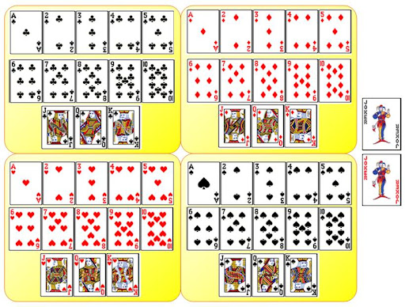

# Jeu de carte - Java Swing

Ce dépôt est dans le cadre du cours Design Patterns en se basant sur le cours 
d'[openclassroom](https://openclassrooms.com/fr/courses/6810956-ecrivez-du-code-java-maintenable-avec-mvc-et-solid).

## Fonctionnalités (règles de jeu)
On considère un paquet de carte

- Créer un jeu classique de 52 cartes ;
- Entrer les noms des joueurs (en limitant le nombre à cinq) ;
-  Mélanger les cartes ;
-  Distribuer une carte à chaque joueur (face cachée) ;
-  Retourner les cartes de tous les joueurs, afin qu’elles soient visibles ;
-  Identifier le joueur gagnant.
    C’est le joueur ayant la carte dont la valeur est la plus forte avec les conventions :
    -- As > Roi > Reine > Valet > 10 > . . . 2 (types/couleurs confondus) ;
    -- Trèfle > Pique > Coeur > Carreau (en cas d’égalité de valeur).
- Présenter le nom et la carte du joueur gagnant.
- Remettre toutes les cartes dans le jeu.
- Retourner au point 3 jusqu’à l’arrêt du jeu.
A cela, s’ajoute le faite de tenir compte de d’autres règles dans le futur :
- nombre de cartes total,
- nombre de cartes que détient un joueur,
- calcul du score,

  
## Rendus
A mettre à jour